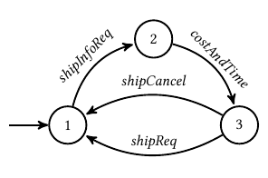
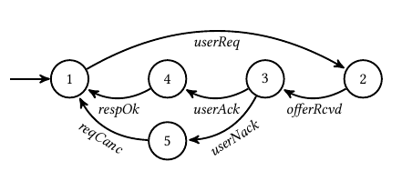
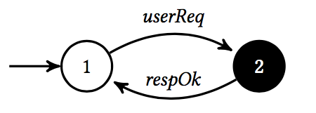
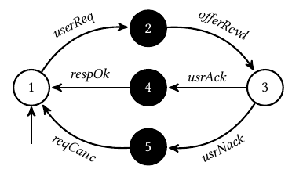

# Purchase&Delivery

In the purchase and delivery example, we imagine that the developer has to design a system that manages book orders.
The users purchese books online which must be delivered.
The purchase and delivering component must use a furniture-sale and a shipping service to provide the desired functionality to the user.

We consider two partial design for the purchase and delivering component. 
These designs are contained in the file `purchaseAndDelivery.lts`, where the two purchase and delivering components are indicated as `purchaseAndDelivery1` and `purchaseAndDelivery2`, respectively.

Before discussing the two designs, we describe the environment in which they operate and the properties the components aim to ensure.

#### Environment
The environment where the components are deployed is composed by three components:
* *Furniture sale*: aims at providing information about books and provide the books for being delivered 

* *Shipping service*: provides information about cost and time of the shipping and allows to ship a book 

* *User*: performs requests to the purchase and delivery system 

The purchase and delivering component must synchronize the *Furniture sale*, the *Shipping service* and the *User*.
#### Properties of interest

* the system must check the presence of some book or ask shipping info only if the user sent a request:
  * `P1=(! ( (!F_UsrReq) U (F_ShipInfoReq || F_ProdInfoReq) ) )`;
* an offer is provided to the user only if the furniture service has confirmed the availability of the requested product:
  * `P2= U F_OfferRcvd))) `;
* furniture and shipping are activated only if the user has decided to purchase. Specifically, after a user requests information about a product (i.e., the event `usrReq` occurs) a `userAck` always precedes a `shipReq` and a `userAck` always precedes a `prodReq`):
  * `P3= W F_ShipReq)) && (!(!(F_UserAck) W F_ProdReq)) )`;
* the system allows canceling an order only if the cancellation procedure was initiated by a user (i.e., a `prodCancel` or `shipCancel` event is always precedeed by a `userNack`):
  * `P4= W (F_ProdCancel || F_ShipCancel)))))`;
* a request is marked as canceled when both the product ordering and the shipping services have canceled the request (i.e., `F_ProdCancelled` and `F_ShipCancelled` always occur before `F_ReqCancelled`):
  * `P5= W F_ReqCancelled)) && !((!(F_ShipCancelled) W F_ReqCancelled))))`;
* a request succeeds only when both the product ordering and the shipping service have handled their requests correctly (i.e., the event `respOk` can occur only after the `prodReq` and the `shipReq` events occurred. These events indicate that a product request and a shipping request have been received and handled correctly by the furniture sale and the shipping services):
  * `P6= && (F_RespOk W shipReq) )`;
* after the user cancels a request, he/she can start a new session with the purchase and delivery system by performing a new request:
  * `P7= (&&<>F_ReqCancelled))`.

## Partial design 1

In the first design the purchase and delivery component is made by two states: the regular state `1` and the black box state `2`. 
The purchase and delivery moves from state `1` to state `2` whenever a `userReq` event is triggered.
It moves from `2` to `1` whenever a `respOk` event is reveived. 
The interface of state `2` contains all the events of the environment with the exception of `userReq` and `respOk`.

#### Experiment 1
The following Table contains the results obtained without adding post-conditions to the state 2, where `T` means that the procedure returns a positive results while `F` specifies that the procedure failed.
    

By running the *realizability checker* it is possible to conclude that:

| Property | Realizability Checker | 
| ---------|-----------------------|
| P1       |        
T
             |  
| P2       |        
T
             |   
| P3       |       
T
             |    
| P4       |        
T
           |     
| P5       |        
T
            |      
| P6       |       
T
            |      
| P7       |       
F
             |     

##### Realizability checker

* `P1`: it is possible to realize a component that ensures that the system satisfies `P1`. Specifically, the realizability checker returned the following trace:  `userReq`,	`offerRcvd`, `usrAck`, `respOk`, `userReq`, `offerRcvd`, `usrAck`, `respOk`, `userReq`, `offerRcvd`, `usrAck`. 
This is a trace that can be enforced by the purchase and delivery component that ensures that the system checks the presence of some book or ask shipping info only if the user sent a request.
* `P2`: it is possible to realize a component that ensures that the system satisfies `P2`. Specifically, the realizability checker returned the following trace:  
`userReq`, `prodInfoReq`, `infoRcvd`, `offerRcvd`, `usrNack`, `reqCancelled`, `shipInfoReq`, `costAndTime`, `prodReq`, `prodInfoReq`, `infoRcvd`, `shipReq`, `shipInfoReq`, `costAndTime`, `prodReq`, `prodInfoReq`, `infoRcvd`, `shipReq`.  
This trace ensures that after a `userReq` event occurs, the offer is provided to the user (the event `offerRcvd` occurs) only if the furniture service has confirmed the availability of the requested product (the event `inforRcvd` occurs). 
* `P3`: it is possible to realize a component that ensure that the system satisfies `P3`. Specifically, the realizability checker returned the following trace: 
`userReq`, `offerRcvd`, `shipInfoReq`, `costAndTime`, `usrAck`, `respOk`, `userReq`, `offerRcvd`, `usrAck`, `respOk`, `userReq`, `offerRcvd`, `usrAck`.
This trace satisfies `P3` since the event `shipReq` never occurs. However, the developer would probably force the `shipReq` to finally occur. Thus we designed the properties `P3a` and `P3b` as follows
 * `P3a = W F_ShipReq)&&<>F_ShipReq))` 
 Also a partial component that satisfies this requirement is satifiable. Specifically, the realizability checker returned the following trace: 
 `userReq`, `offerRcvd`, `usrAck`, `shipInfoReq`, `costAndTime`, `shipReq`, `respOk`, `userReq`, `offerRcvd`, `usrAck`,	`shipInfoReq`, `prodInfoReq`, `infoRcvd`, `prodReq`, `respOk`, `userReq`, `offerRcvd`, `usrAck`, `costAndTime`, `shipReq`, `respOk`, `userReq`, `offerRcvd`, `usrAck`, `shipInfoReq`, `prodInfoReq`, `infoRcvd`, `prodReq`, `respOk`, `userReq`, `offerRcvd`, `usrAck`, `costAndTime`, `shipReq`, `respOk`, `userReq`, `offerRcvd`, `usrAck`, `shipInfoReq`, `prodInfoReq`, `infoRcvd`, `prodReq`.
 A similar trace can be found by considering the requirement `P3b` as follows:
  * `P3b = W F_ShipReq)&&<>F_ShipReq))` 
   Also a partial component that satisfies this requirement is satifiable. Specifically, the realizability checker returned the following trace: 
`userReq`, `offerRcvd`, `usrAck`, `shipInfoReq`, `costAndTime`, `prodInfoReq`, `infoRcvd`, `prodReq`, `prodInfoReq`, `respOk`, `userReq`, `offerRcvd`, `usrAck`, `infoRcvd`, `prodReq`, `prodInfoReq`, `respOk`, `userReq`,	`offerRcvd`, `usrAck`, `infoRcvd`,	`prodReq`, `prodInfoReq`, `respOk`.	
* `P4:` it is possible to realize a component that ensures that the system satisfies `P1`. Specifically, the realizability checker returned the following trace:  
`userReq`, `offerRcvd`, `usrNack`, `reqCancelled`, `shipInfoReq`, `costAndTime`, `prodInfoReq`, `shipCancel`, `shipInfoReq`, `costAndTime`, `shipCancel`, `shipInfoReq`, `costAndTime`, `shipCancel`. 
This trance ensures that a `userAck` event is followed by a `F_ShipCancel`. However, as previously it is possible to force the events `prodCancel` and `shipCancel` to occur. Specifically, the requirements `P4a` and `P4b` are designed as follows:
 * `P4a= W (F_ProdCancel)))&&<>F_ProdCancel))` 
  Also a partial component that satisfies this requirement is satifiable. Specifically, the realizability checker returned the following trace: 
  `userReq`, `offerRcvd`, `usrNack`, `reqCancelled`, `shipInfoReq`,	`costAndTime`, `prodInfoReq`, `infoRcvd`, `prodCancel`, `shipReq`,	`shipInfoReq`, `costAndTime`, `prodInfoReq`, `infoRcvd`, `prodCancel`, `shipReq`, `shipInfoReq`, `costAndTime`, `prodInfoReq`, `infoRcvd`, `prodCancel`.
 * `P4b= W (F_ShipCancel)))&&<>F_ShipCancel))` 
  Also a partial component that satisfies this requirement is satifiable. Specifically, the realizability checker returned the following trace: 
  `userReq`, `offerRcvd`, `usrNack`, `reqCancelled`, `shipInfoReq`,	`costAndTime`, `prodInfoReq`, `shipCancel`,	`shipInfoReq`, `costAndTime`, `shipCancel`,	`shipInfoReq`, `costAndTime`, `shipCancel`.	
* `P5: W F_ReqCancelled)) && !((!(F_ShipCancelled) W F_ReqCancelled))))`  it is possible to realize a component that ensure that the system satisfies `P5`. Specifically, the realizability checker returned the following trace: 
`userReq`, `offerRcvd`, `usrNack`, `shipInfoReq`, `costAndTime`, `shipCancel`, `shipInfoReq`, `costAndTime`, `prodInfoReq`, `infoRcvd`, `prodCancel`, `reqCancelled`, `prodInfoReq`, `infoRcvd`, `prodCancel`, `prodInfoReq`, `shipCancel`, `shipInfoReq`, `costAndTime`, `infoRcvd`, `prodCancel`, `prodInfoReq`, `shipCancel`, `shipInfoReq`, `costAndTime`, `infoRcvd`,	`prodCancel`, `prodInfoReq`, `shipCancel`.	
Note that the subproperty `!((!(F_ShipCancelled) W F_ReqCancelled))` is satisfied since the fluent `F_ReqCancelled` is never true. Thus, it is possible to decompose `P5` as follows:
  * `P5a= W F_ReqCancelled))&&<>F_ReqCancelled))` 
A component that satisfies this requirement is realizable. Specifically, the realizability checker returned the following trace: 
`userReq`, `offerRcvd`, `usrNack`, `shipInfoReq`, `costAndTime`, `prodInfoReq`, `infoRcvd`, `prodCancel`, `reqCancelled`, `shipReq`, `shipInfoReq`, `costAndTime`, `shipReq`, `shipInfoReq`, `costAndTime`, `shipReq`.		
 * `P5b= W F_ReqCancelled))&&<>F_ReqCancelled))` 
 A component that satisfies this requirement is realizable. Specifically, the realizability checker returned the following trace:
 
`userReq`, `offerRcvd`, `usrNack`, `shipInfoReq`, `costAndTime`, `shipCancel`, `reqCancelled`, `shipInfoReq`, `costAndTime`, `prodInfoReq`, `shipCancel`, `shipInfoReq`, `costAndTime`, `shipCancel`, `shipInfoReq`, `costAndTime`, `shipCancel`. 
* `P6= && (F_UserNack-> <>F_ReqCancelled) )` it is possible to realize a component that ensure that the system satisfies `P6`. Specifically, the realizability checker returned the following trace: 
`userReq`, `offerRcvd`, `usrNack`, `reqCancelled`, `shipInfoReq`, `costAndTime`, `shipReq`, `shipInfoReq`, `costAndTime`, `shipReq`, `shipInfoReq`, `costAndTime`.	
Note that the requirement does not force the fluents `F_UserAck` and `F_UserNack` occur. Thus we rewritten `P6` as:
 * `P6a= && <>F_UserAck )` 
    A component that realizes `P6a` could exist.
 * `P6b= &&<>F_UserNack)` 
    A component that realizes `P6b` could exist.
* `P7= (&&<>F_ReqCancelled))`  
A component that satisfies `P7` is not realizable. Specifically, the box `2` can be left only if a `respOk` event occurs and no `userReq` event can occur while the purchase and delivery component is in `2`. Thus, after a `reqCanc` it is not possible to trigger the event `userReq`.
This implies that the design of the partial controller must be modified.

## Partial design 2
In the second design the purchase and delivery component is made by five states: the regulars state `1` and `3` and the boxes `2`, `4` and `5`. 
The purchase and delivery moves from state `1` to state `2` whenever a `userReq` event is triggered.
It moves from `2` to `3` whenever a `offerRcvd` event is reveived. 
It moves from `3` to `4` and from `4` to `1` whenever a `userAck` and a `respOk` event is reveived. 
It moves from `3` to `5` and from `5` to `1` whenever a `userNack` and a `reqCanc` event is reveived. 

#### Experiment 2
The following Table contains the results obtained without adding post-conditions to the boxes, where `T` means that the procedure returns a positive results while `F` specifies that the procedure failed.
    

By running the *realizability checker* it is possible to conclude that a component that ensures the satisfaction of all the properties of interest could be realizable. Specifically, also property `P7` can be satisfied by the current partial component.

| Property | Realizability Checker | 
| ---------|-----------------------|
| P1       |        
T
             |  
| P2       |        
T
             |   
| P3a       |       
T
             |    
| P3b       |       
T
             |    
| P4a       |        
T
           |     
| P4b       |        
T
           |     
| P5a       |        
T
            |    
| P5b       |        
T
            |    
| P6a       |       
T
            |     
| P6b       |       
T
            |     
| P7       |       
T
             |     

##### Model checker
The following Table contains the results obtained without adding post-conditions to the boxes, where `T` means that the procedure returns a positive results while `F` specifies that the procedure failed.

By running the *model checker* it is possible to conclude that the partial design satisfies the following properties. 

| Property | Model checker | 
| ---------|-----------------------|
| P1       |        
T
             |  
| P2       |        
F
             |   
| P3a       |       
F
             |    
| P3b       |       
F
             |    
| P4a       |        
F
           |     
| P4b       |        
F
           |     
| P5a       |        
F
            |    
| P5b       |        
F
            |    
| P6a       |       
F
            |     
| P6b       |       
F
            |     
| P7       |       
F
             | 

* `P1`: the partial design ensures the satisfaction of property `P1`. Indeed, the partial design 2 forces the system to start with a `usrReq` event, that occurs befor state `2` in which a `shipInfoReq` and a `prodInfoReq` can occur.
* `P2`: the partial design `2` violates the property `P2`. Specifically, the model checker returned the following counterexample: 
`userReq`, `tau`, `offerRcvd`. 
In this trace the event `offerRcvd` is not preceeded by the event `infoRcvd`.
* `P3a`: the partial design `2` violates the property `P3a`. Specifically, the model checker returned the following counterexample: 
`userReq`, `tau`, `offerRcvd`, `usrNack`, `tau`, `reqCancelled`, `userReq`, `tau`, `offerRcvd`, `usrNack`, `tau`, `reqCancelled` `usrReq`, `tau`, `offerRcvd`, `usrNack` 
In this trace the event `userReq` is never followed by a `shipReq`.
* `P3b`: the partial design `2` violates the property `P3b`. Specifically, the model checker returned the following counterexample: 
`userReq`, `tau`, `offerRcvd`, `usrNack`, `tau`, `reqCancelled`, `userReq`, `tau`, `offerRcvd`,	`usrNack`, `tau`, `reqCancelled`, `userReq`, `tau`, `offerRcvd`, `usrNack`.	 
In this trace the event `userReq` is never followed by a `prodReq`.
* `P4a`: the partial design `2` violates the property `P4a`. Specifically, the model checker returned the following counterexample: 
`userReq`, `tau`, `offerRcvd`, `usrAck`, `tau`, `respOk`, `userReq`, `tau`, `usrAck`, `tau`, `respOk`, `userReq`, `tau`,
`offerRcvd`, `usrAck`.  
In this trace the event `userReq` is never followed by a `prodCancel`.
* `P4b`:  the partial design `2` violates the property `P4b`. Specifically, the model checker returned the following counterexample: 
`userReq`, `tau`, `offerRcvd`, `usrAck`, `tau`, `respOk`, `userReq`, `tau`, `offerRcvd`, `usrAck`, `tau`, `respOk`, `userReq`, `tau`, `offerRcvd`, `usrAck`. 
In this trace the event `userReq` is never followed by a `shipCancel`.
* `P5a`:  the partial design `2` violates the property `P5a`. Specifically, the model checker returned the following counterexample: 
`userReq`, `tau`, `offerRcvd`, `usrAck`, `tau`, `respOk`, `userReq`, `tau`, `offerRcvd`, `usrAck`, `tau`, `respOk`, `userReq`, `tau`, `offerRcvd`, `usrAck`.	 
In this trace the event `userReq` is not followed by a `reqCancelled`.
* `P5b`: the partial design `2` violates the property `P5b`. Specifically, the model checker returned the following counterexample: 
`userReq`, `tau`, `offerRcvd`, `usrNack`, `tau`, `reqCancelled`, `userReq`, `tau`, `shipInfoReq`, `costAndTime`, `offerRcvd`, `usrAck`, `tau`, `respOk`, `userReq`, `tau`, `offerRcvd`, `usrAck`, `tau`, `respOk`, `userReq`, `tau`, `offerRcvd`, `userAck`.  
In this trace the event `reqCancelled` follows the event `userReq` without being preceeded by a `shipCancelled`. 
* `P6a`: the partial design `2` violates the property `P6b`. Specifically, the model checker returned the following counterexample: 
`userReq`, `tau`, `offerRcvd`, `usrNack`, `tau`, `reqCancelled`, `userReq`, `tau`, `offerRcvd`, `usrNack`, `tau`, `reqCancelled`, `userReq`, `tau`, `offerRcvd`, `usrNack`. 
In this trace the event `userAck` never occurred.
* `P6b`: the partial design `2` violates the property `P6b`. Specifically, the model checker returned the following counterexample: 
`userReq`, `tau`, `offerRcvd`, `usrAck`, `tau`, `respOk`, `userReq`, `tau`, `offerRcvd`, `userAck`, `tau`, `respOk`, `userReq`, `tau`, `offerRcvd`, `usrAck`. 
In this trace the event `userNack` never occurred.
* `P7`:  the partial design `2` violates the property `P7`. Specifically, the model checker returned the following counterexample: 
`userReq`, `tau`, `offerRcvd`, `usrNack`, `tau`, `respOk`, `userReq`, `tau`, `offerRcvd`, `usrAck`, `tau`, `respOk`, `userReq`, `tau`, `offerRcvd`, `userAck`. 
In this trace the event `reqCancelled` never occurred.

## Partial design 2 with post-conditions
 
The following Table contains the results obtained by adding post-conditions to the boxes, where `T` means that the procedure returns a positive results while `F` specifies that the procedure failed.

By running the *model checker* it is possible to conclude that the partial design satisfies the following properties. 

| Property | Model checker | 
| ---------|-----------------------|
| P1       |        
T
             |  
| P2       |        
F
             |   
| P3a       |       
F
             |    
| P3b       |       
F
             |    
| P4a       |        
F
           |     
| P4b       |        
F
           |     
| P5a       |        
F
            |    
| P5b       |        
F
            |    
| P6a       |       
F
            |     
| P6b       |       
F
            |     
| P7       |       
F
             | 

* `P1`: the property was already satisfied also without post-conditions;
* `P2`:
