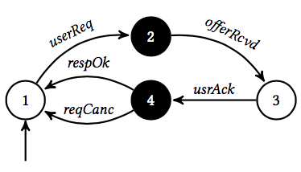

# Purchase&Delivery

In the *purchase and delivery* example, we imagine that the developer has to design a system that manages book orders.
The users purchese books online which must be delivered.
The purchase and delivering component must use a furniture-sale and a shipping service to provide the desired functionality to the user.

We consider two partial designs for the purchase and delivering component. 
These designs are contained in the file *purchaseAndDelivery.lts*, where the two purchase and delivering components are indicated as `COMPONENT1` and `COMPONENT2` associated with processes `PartialComponent1` and `PartialComponent2`, respectively.

Before discussing the two designs, we describe the environment in which they operate and the properties the components aim to ensure.

#### Environment
The environment where the components are deployed is composed by three components:

* *Furniture sale*: aims at providing information about books and provide the books for being delivered 

* *Shipping service*: provides information about cost and time of the shipping and allows to ship a book 

* *User*: performs requests to the purchase and delivery system 

The purchase and delivering component must synchronize the *furniture sale*, the *shipping service* and the *user*.
#### Properties of interest

* the system must check the presence of some book or ask shipping info only if the user sent a request:
  * `P1=(!((!F_UsrReq) U (F_ShipInfoReq || F_ProdInfoReq)))`;
* an offer is provided to the user only if the furniture service has confirmed the availability of the requested product:
  * `P2= U F_OfferRcvd))) `;
* the shipping service is activated only if the user has decided to purchase. Specifically, after a user requests information about a product (i.e., the event `usrReq` occurs) a `userAck` always precedes a `shipReq`:
  * `P3= W F_ShipReq))&&<>F_ShipReq))`;
*  after a user request is received, no user ack precedes the canceling of the request:
  * `P4=U(F_ReqCanc)))-> (!F_UserAck W F_ReqCanc)))` 
  

## Partial design 1

In the first design the purchase and delivery component is made by four states: the regular states `1` and `3` and the black box states `2` and `4`. 
The purchase and delivery moves from state `1` to state `2` whenever a `userReq` event is triggered.
It moves from `2` to `3` whenever a `offerRcvd` event is reveived. 
The state `3` is left when a `userAck` event occur. 
Finally, the purchase and delivery component moves from state `4` to `1` whenever a `respOk` or a `reqCanc` event occurs.

#### Experiment 1
*Running the realizability checker*:

The following Table contains the results obtained without adding any post-condition to the state 2, where `T` means that the procedure returns a positive results while `F` specifies that the procedure failed. By running the *realizability checker* it is possible to conclude that:

<table border="1">
    <tr>
        <th>Property</th>
        <th>Realizability Checker</th>
    </tr>
    <tr>
        <td>P1</td>
        <td>
T
 </td>
    </tr>
    <tr>
        <td>P2</td>
        <td>
T
 </td>
    </tr>
    <tr>
        <td>P3</td>
        <td>
T
 </td>
    </tr>
    <tr>
        <td>P4</td>
        <td>
T
 </td>
    </tr>
    <tr>
        <td>P4a</td>
        <td>
F
</td>
    </tr>
</table>

* `P1`: it could be possible to realize a component that ensures that the system satisfies `P1`. Specifically, the realizability checker returned the following trace: 
`userReq`, `offerRcvd`, `usrNack`,	`reqCanc`,	`shipInfoReq`,	`costAndTime`,	`shipReq`, `shipInfoReq`, `costAndTime`, `shipReq`, `shipInfoReq`, `costAndTime`. 
This is a trace that can be enforced by the purchase and delivery component and ensures that the system asks shipping info if and only if the user sent a request.
* `P2`: it is possible to realize a component that ensures that the system satisfies `P2`. Specifically, the realizability checker returned the following trace:  
`userReq`, `shipInfoReq`, `costAndTime`, `prodInfoReq`, `infoRcvd`, `offerRcvd`, `usrNack`, `reqCanc`, `shipReq`, `shipInfoReq`, `prodReq`, `prodInfoReq`, `infoRcvd`, `costAndTime`, `shipReq`, `shipInfoReq`, `prodReq`, `prodInfoReq`, `infoRcvd`, `costAndTime`.  
This trace ensures that after a `userReq` event occurs, the offer is provided to the user (the event `offerRcvd` occurs) only if the furniture service has confirmed the availability of the requested product (the event `inforRcvd` occurs). 
* `P3`: it is possible to realize a component that ensures the system satisfies `P3`. Specifically, the realizability checker returned the following trace: 
`userReq`, `offerRcvd`, `usrAck`, `shipInfoReq`, `costAndTime`, `shipReq`, `prodInfoReq`, `infoRcvd`, `respOk`, `userReq`, `offerRcvd`, `usrAck`, `shipInfoReq`, `costAndTime`, `shipReq`, `respOk`, `userReq`, `offerRcvd`, `usrAck`, `shipInfoReq`, `costAndTime`, `shipReq`, `respOk`. 
This trace satisfies `P3` since the event `shipReq` is always preceeded by a `userAck`.
* `P4`: a component that satisfies `P4` is  realizable. Specifically, the realizability checker returned the following trace:  
`userReq`, `shipInfoReq`, `costAndTime`, `shipCancel`, `shipInfoReq`, `costAndTime`, `shipCancel`, `shipInfoReq`, `costAndTime`
In this trace the event `reqCanc` never occurred for this reason the developer checks the requirement `P4a` made as follows
* `P4a=U(F_ReqCanc)))-> (!F_UserAck W F_ReqCanc))&&<>F_ReqCanc)`  
A component that satisfies `P4` is not realizable. Indeed, a component in which a `reqCanc` event is not preceeded by a `usrAck` is not realizable.

## Partial design 2
In the second design the purchase and delivery component is made by five states: the regulars state `1` and `3` and the boxes `2`, `4` and `5`. 
The purchase and delivery moves from state `1` to state `2` whenever a `userReq` event is triggered.
It moves from `2` to `3` whenever a `offerRcvd` event is reveived. 
It moves from `3` to `4` and from `4` to `1` whenever a `userAck` and a `respOk` event is reveived. 
It moves from `3` to `5` and from `5` to `1` whenever a `userNack` and a `reqCanc` event is reveived. 

#### Experiment 2: partial design 2 with no post-conditions
*Running the realizability checker*:

The following Table contains the results obtained without adding post-conditions to the boxes, where `T` means that the procedure returns a positive results while `F` specifies that the procedure failed. By running the *realizability checker* it is possible to conclude that a component that ensures the satisfaction of all the properties of interest could be realizable. Specifically, also property `P4` can be satisfied by the current partial component.

<table border="1">
    <tr>
        <th>Property</th>
        <th>Realizability Checker</th>
    </tr>
    <tr>
        <td>P1</td>
        <td>
T
 </td>
    </tr>
    <tr>
        <td>P2</td>
        <td>
T
 </td>
    </tr>
    <tr>
        <td>P3</td>
        <td>
T
 </td>
    </tr>
    <tr>
        <td>P4</td>
        <td>
T
 </td>
    </tr>
    <tr>
        <td>P4a</td>
        <td>
T
</td>
    </tr>
</table>

*Running the model checker*:

The following Table contains the results obtained without adding post-conditions to the boxes, where `T` means that the procedure returns a positive results while `F` specifies that the procedure failed. By running the *model checker* it is possible to conclude that the partial design satisfies the following properties. 

<table border="1">
    <tr>
        <th>Property</th>
        <th>Model checker</th>
    </tr>
    <tr>
        <td>P1</td>
        <td>
T
 </td>
    </tr>
    <tr>
        <td>P2</td>
        <td>
F
 </td>
    </tr>
    <tr>
        <td>P3</td>
        <td>
F
 </td>
    </tr>
    <tr>
        <td>P4</td>
        <td>
F
 </td>
    </tr>
</table>

* `P1`: the partial design ensures the satisfaction of property `P1`. Indeed, the partial design 2 forces the system to start with a `usrReq` event, that occurs befor state `2` in which a `shipInfoReq` and a `prodInfoReq` can occur.
* `P2`: the partial design `2` violates the property `P2`. Specifically, the model checker returned the following counterexample: 
`userReq`, `tau`, `offerRcvd`. 
In this trace the event `offerRcvd` is not preceeded by the event `infoRcvd`.
* `P3`: the partial design `2` violates the property `P3`. Specifically, the model checker returned the following counterexample: 
`userReq`, `tau`, `offerRcvd`, `usrNack`, `tau`, `reqCancelled`, `userReq`, `tau`, `offerRcvd`, `usrNack`, `tau`, `reqCancelled` `usrReq`, `tau`, `offerRcvd`, `usrNack` 
In this trace the event `userReq` is never followed by a `shipReq`.
* `P4`: the partial design `2` violates the property `P4`. Specifically, the model checker returned the following counterexample: 
`userReq`, `tau`, `offerRcvd`, `usrAck`, `tau`, `respOk`, `userReq`, `tau`, `offerRcvd`, `usrNack`, `tau`, `reqCanc`, `userReq`, `tau`, `offerRcvd`, `usrNack`, `tau`, `reqCanc`, `tau`, `offerRcvd`, `usrNack`, `tau`.  
In this trace, after a `userReq` event occurs, the event `reqCanc` is not preceeded by a `usrNack`. 

#### Experiment 3: partial design 2 with post-conditions
*Running the model checker*:
 
The following Table contains the results obtained by adding post-conditions to the boxes, where `T` means that the procedure returns a positive results while `F` specifies that the procedure failed. By running the *model checker* it is possible to conclude that the partial design satisfies the following properties. 

<table border="1">
    <tr>
        <th>Property</th>
        <th>Model checker</th>
    </tr>
    <tr>
        <td>P1</td>
        <td>
T
 </td>
    </tr>
    <tr>
        <td>P2</td>
        <td>
T
 </td>
    </tr>
    <tr>
        <td>P3</td>
        <td>
T
 </td>
    </tr>
    <tr>
        <td>P4</td>
        <td>
T
 </td>
    </tr>
</table>

* `P1`: the property was already satisfied also without post-conditions;
* `P2`: the post-condition `<>(F_InfoRcvd)&&<>(F_CostAndTime)` on box `2` ensures the satisfaction of `P2`.
* `P3`:  the post-condition `(<>(F_ProdReq)&&<>(F_ShipReq))` on box `4` ensures the satisfaction of `P3`. 
* `P4`: the post-condition `((!F_UserAck) U F_ReqCanc)` on box `5` ensures the satisfaction of `P4`

#### Experiment 4: partial design 2 with pre-conditions
*Running the well-formedness checker*:

The following Table contains the results obtained by adding post-conditions to the boxes, where `T` means that the procedure returns a positive results while `F` specifies that the procedure failed. By running the *model checker* it is possible to conclude that the partial design satisfies all the pre-conditions of the boxes. 

<table border="1">
    <tr>
        <th>Precondition</th>
        <th>Well-formedness checker</th>
    </tr>
    <tr>
        <td>Box 2 </td>
        <td>
T
 </td>
    </tr>
    <tr>
        <td>Box 4 </td>
        <td>
T
 </td>
    </tr>
    <tr>
        <td>Box 5 </td>
        <td>
T
 </td>
    </tr>
</table>    

## Sub-component 1 for state 2

In the following a sub-component for state `2` is shown. 
Specifically, the sub-component is made by states `1`, `2`, `3` and `4`.
The sub-component moves from `1` to `2`, `2` to `3` and `3` to `4` when events `shipInfoReq`, `costAndTime` and `prodInfoReq` occur.

#### Experiment 5: checking a sub-component

*Running the substitutability checker*:

By running the sub-stitutability checker it is possible to verify whether the sub-component satisfies the post-conditions of the corresponding box. Specifically the substitutability checker is used to verify whether the sub-component 1 ensures that the post-condition `<>(F_InfoRcvd)&&<>(F_CostAndTime)` is satisfied.

The substitutability checker returned the following counterexample: 
`userReq`, `init`, `shipInfoReq`, `costAndTime`, `prodInfoReq`, `end`, `end`, `end`. 
Indeed, this run reaches the final state of the sub-component and in this run the event `infoRcvd` does not occur.

## Sub-component 2 for state 2

In the following a sub-component for state `2` is shown. 
Specifically, the sub-component is made by states `1`, `2`, `3`, `4` and `5`.
The sub-component moves from `1` to `2`, `2` to `3`, `3` to `4` and `4` to `5`  when events `shipInfoReq`, `costAndTime`, `prodInfoReq` and `infoRcvd` occur.

#### Experiment 6: checking a sub-component

*Running the substitutability checker*:

By running the sub-stitutability checker it is possible to verify whether the sub-component satisfies the post-conditions of the corresponding box. Specifically the substitutability checker is used to verify whether the sub-component 1 ensures that the FLTL post-condition `<>(F_InfoRcvd)&&<>(F_CostAndTime)` is satisfied.

The substitutability checker confirms that the post-condition is satisfied.

